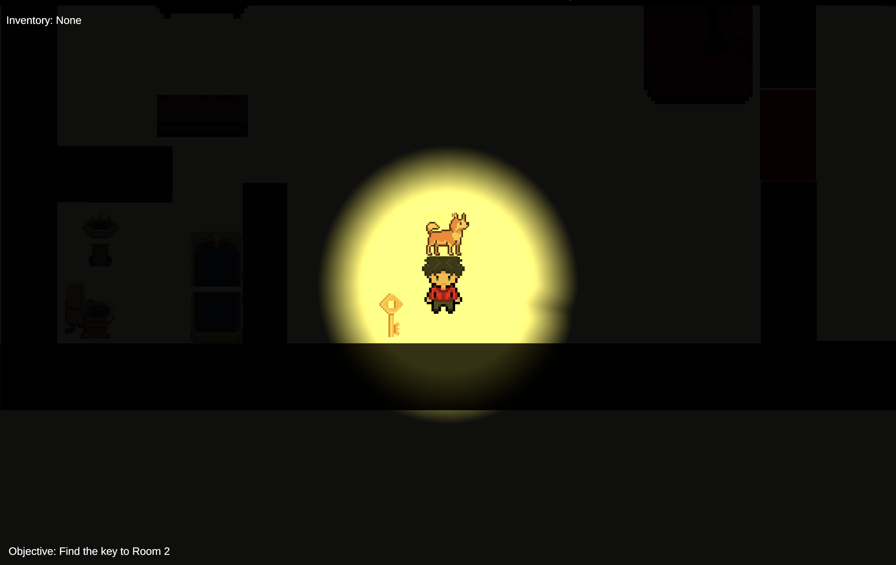
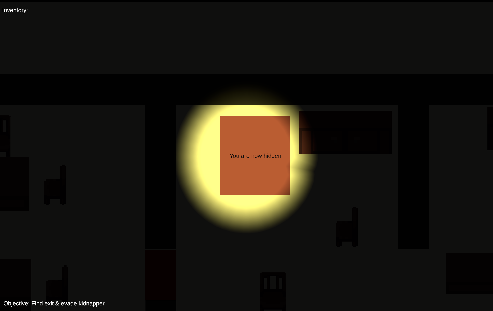
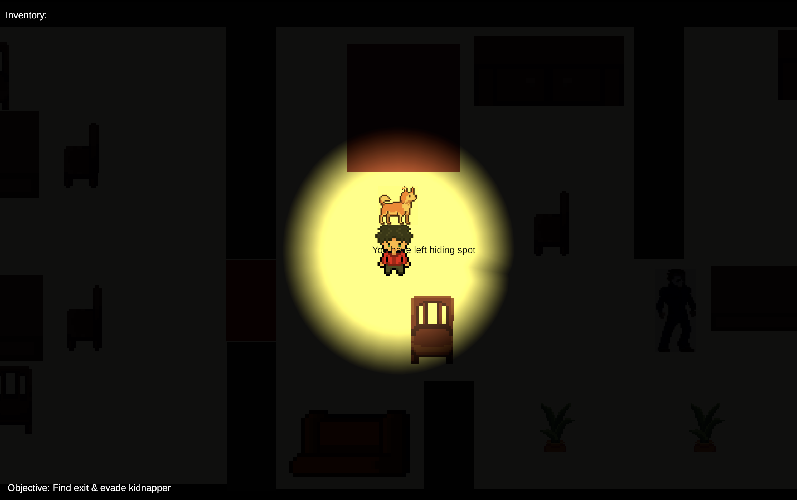

# Whispers of the Forgotten

A **2D horror escape room** game where the player must find keys and evade a kidnapper to escape — featuring a barking NPC dog companion and a chasing antagonist. Inspired by *Little Nightmares* and *Among the Sleep*.

**Play the game:** [https://marcosv5.github.io/CSS385-FinalProject/](https://marcosv5.github.io/CSS385-FinalProject/)

**Game page (with screenshots & playtesting reports):** [https://vinisha231.github.io/WhispersOfTheForgotten/](https://vinisha231.github.io/WhispersOfTheForgotten/)

---

## About

| | |
|--|--|
| **Platform** | Web (Unity WebGL) |
| **Genre** | Horror / Puzzle / Escape Room |
| **Launch Date** | June 2025 |
| **Rating** | 10+ (Horror Themes) |
| **Team** | Team F15 — CSS 385, UW Bothell |

---

## Gameplay

- Navigate a dark 2D environment from a top-down perspective
- Find keys scattered across rooms to unlock the exit
- Avoid the **kidnapper** who actively chases the player
- Your **dog companion** barks to warn you of nearby danger
- Escape before you're caught

---

## Screenshots

  
  
  

---

## Team

| Name | Role |
|------|------|
| Vinisha Bala Dhayanidhi | Developer |
| Peter Sokolov | Developer |
| Marcos Vasquez | Developer |
| Anish Gangu | Developer |

---

## Assets & Credits

All assets were created by the team or sourced from royalty-free providers:

- **Room Assets:** [2D Basic Room Assets](https://assetstore.unity.com/packages/2d/2d-basic-room-assets-234762) by PixelChad (Unity Asset Store)
- **Furniture & Interior Tiles:** [House Interior Tileset 32x32](https://assetstore.unity.com/packages/2d/environments/house-interior-tileset-32x32-307712) by Graduation Cat (Unity Asset Store)
- **Dog Barking Sounds:** [SoundBible.com](https://soundbible.com/tags-dog-bark.html) (Royalty Free)
- **Character Sprites:** Modified from [OpenGameArt.org](https://opengameart.org/) royalty-free templates

---

## Playtesting

Three rounds of playtesting were conducted during development. Reports are available in the repo and on the [game page](https://vinisha231.github.io/WhispersOfTheForgotten/).
